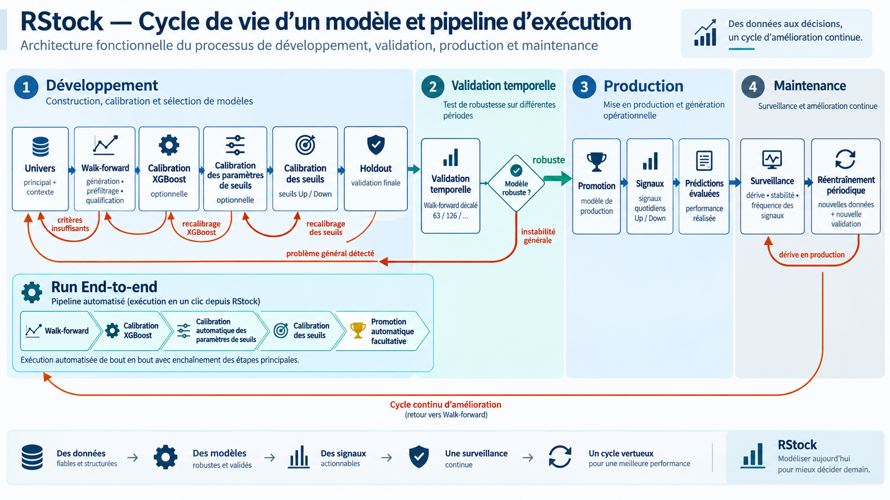

# Documentation RStock

# 1. Vue d’ensemble / Processus

RStock est une application d’analyse et de sélection de modèles de prévision boursière.

L’objectif n’est pas de produire une prédiction unique, mais de construire un processus reproductible permettant de :

1. définir les titres et données utilisés;
2. générer et tester plusieurs combinaisons de prédicteurs;
3. mesurer leur robustesse dans le temps;
4. ajuster les paramètres du modèle;
5. calibrer les seuils qui déclenchent les signaux;
6. valider les résultats sur une période indépendante;
7. sélectionner les modèles jugés suffisamment robustes;
8. promouvoir ces modèles;
9. suivre ensuite leurs signaux et leurs résultats.

  
---

---

## 1.1 Cycle de vie complet d’un modèle

Le processus s’inscrit dans un cycle : une méthodologie est développée,
validée sur plusieurs périodes, promue, puis surveillée et réévaluée.

### Phase 1 — Développement

**Univers → Walk-forward récent → Calibration XGBoost → Calibration des
paramètres de seuils → Calibration des seuils → Holdout**

Objectif : définir une méthodologie et un modèle suffisamment robustes.

### Phase 2 — Validation temporelle

**Même méthodologie → Walk-forward décalé 63 → Walk-forward décalé 126 →
éventuellement autres périodes**

Objectif : vérifier que la méthodologie ne dépend pas uniquement de la période
récente. Chaque période décalée est un nouveau Walk-forward ; ses étapes aval
héritent ensuite de sa date de fin effective.

### Phase 3 — Promotion

Si les résultats demeurent suffisamment cohérents :

**Promotion → Modèle de production → Signaux**

### Phase 4 — Suivi en production

Une fois en production, suivre notamment :

- fréquence des signaux ;
- précision réalisée ;
- rendement réalisé ;
- dérive des probabilités ;
- stabilité des modèles ;
- évolution du comportement des marchés.

Les résultats réalisés deviennent progressivement une source de validation plus
importante que les simulations historiques.

### Phase 5 — Réentraînement périodique

Un modèle n’est pas permanent. À intervalles réguliers, relancer le cycle avec
les données récentes :

**Nouvelles données → nouveau Walk-forward avec Décalage = 0 → recalibration
XGBoost si nécessaire → recalibration des paramètres de seuils si nécessaire →
recalibration des seuils → nouvelle validation temporelle → nouvelle promotion**

Le réentraînement ne signifie pas nécessairement que tous les paramètres doivent
changer : il vérifie d’abord que la méthodologie existante reste valide.

### Phase 6 — Remplacement ou retrait

Un modèle peut être remplacé ou retiré si sa performance réalisée ou sa stabilité
se détériore, si les signaux deviennent insuffisants, si son comportement diverge
des périodes historiques, ou si une nouvelle version démontre une robustesse
supérieure. Le remplacement est une nouvelle expérience complète, jamais une
modification silencieuse du modèle actif.

### Vue d’ensemble du processus

**Développement**

Univers → Walk-forward récent → Calibration XGBoost → Calibration des paramètres
de seuils → Calibration des seuils → Holdout

**Validation**

→ Walk-forward décalé 63 → Walk-forward décalé 126 → comparaison de robustesse
temporelle

**Production**

→ Promotion → Signaux → Résultats réalisés

**Maintenance**

→ Surveillance → Réentraînement périodique → Nouvelle validation temporelle →
Nouvelle promotion ou retrait

---

## 1.2 Propriété des paramètres par étape

Chaque étape possède uniquement les paramètres qu’elle est chargée de choisir.
Lorsqu’un run est dérivé, les décisions scientifiques déjà établies en amont
restent gelées. Le choix **Paramètres actuels** ne remplace que les paramètres
propres à la nouvelle étape :

- **Walk-forward → Calibration XGBoost** : univers, données, période, protocole
  walk-forward et baseline XGBoost viennent du walk-forward. Les paramètres
  actuels peuvent modifier le nombre de combinaisons échantillonnées par la
  calibration; la grille et la sélection sont actuellement fixes dans le
  protocole de calibration.
- **Calibration XGBoost → Calibration des seuils** : les configurations
  gagnantes Up/Down, leur provenance et leur digest restent gelés. Seuls les
  paramètres `threshold_calibration_*` et le nombre de combinaisons de la
  calibration des seuils peuvent venir des paramètres actuels.
- **Walk-forward → Calibration des seuils** : en l’absence de calibration
  XGBoost intermédiaire, la calibration des seuils conserve les paramètres
  XGBoost du walk-forward. Les paramètres XGBoost actuellement affichés dans
  l’application ne les remplacent pas.
- **Calibration des paramètres de seuils → Calibration des seuils** : la
  politique gagnante du calibrateur est gelée. Le descendant ne peut pas la
  remplacer par les paramètres actuels; pour effectuer un choix manuel, il faut
  repartir du walk-forward ou de la calibration XGBoost précédente.

Pour changer les hyperparamètres XGBoost d’un modèle après un walk-forward, il
faut produire un nouveau walk-forward, puis reprendre les étapes aval.

---

# 2. Univers

## 2.1 Rôle d’un univers

Un univers définit les symboles qui peuvent être utilisés dans une expérience.

RStock distingue deux types d’univers :

### Univers principal

L’univers principal contient les titres qui peuvent devenir des **cibles de prédiction**.

Exemples :

- actions américaines;
- univers technologique;
- univers diversifié;
- leaders sectoriels.

Les symboles de l’univers principal peuvent également servir de prédicteurs.

### Univers de contexte

Un univers de contexte contient des variables utilisées comme prédicteurs mais qui ne deviennent pas elles-mêmes des cibles.

Exemples :

- SPY;
- QQQ;
- IWM;
- GLD;
- TLT;
- HYG;
- UUP;
- ETF sectoriels.

L’objectif est de fournir au modèle de l’information sur l’environnement de marché.

## 2.2 Population d’une expérience

Une expérience peut utiliser :

- l’univers principal complet;
- un sous-échantillon Top N;
- un ou plusieurs univers de contexte;
- tout l’univers de contexte ou un Top N.

Les symboles sont figés au moment du lancement de l’expérience afin qu’un run puisse être reproduit exactement plus tard.

---

# 3. Walk-forward

## 3.1 Pourquoi utiliser un walk-forward?

Un modèle financier ne doit pas être évalué uniquement sur les données qui ont servi à son entraînement.

Le walk-forward reproduit une utilisation plus réaliste :

1. le modèle apprend sur une période historique;
2. il est testé sur une période suivante qu’il n’a pas vue;
3. la fenêtre avance dans le temps;
4. le processus est répété plusieurs fois.

On obtient ainsi plusieurs fenêtres de validation temporelle.

Un modèle intéressant doit fonctionner dans plusieurs périodes différentes, et non seulement dans une période particulièrement favorable.

---

## 3.2 Paramètres principaux

### Historique

Détermine la profondeur historique chargée pour l’expérience.

Exemple :

`1095 jours`

Ce paramètre ne correspond pas directement au nombre de séances de marché.

---

### Train minimal

Nombre minimal d’observations utilisées avant qu’un premier test puisse être effectué.

Exemple :

`252`

Cela correspond approximativement à une année de séances de marché.

---

### Taille test

Nombre d’observations utilisées pour chaque fenêtre de test.

Exemple :

`63`

Cela correspond approximativement à un trimestre.

---

### Step

Nombre de séances utilisées pour déplacer le walk-forward entre deux fenêtres.

Exemple :

`63`

Avec un test de 63 et un step de 63, les fenêtres de test ne se chevauchent pas.

Un step inférieur à la taille du test crée des fenêtres qui se chevauchent.

---

### Holdout final

Période finale complètement séparée du développement du modèle.

Exemple :

`63`

Le holdout ne doit pas être utilisé pour choisir les paramètres du modèle.

Il sert uniquement à vérifier si les décisions prises sur les données de développement généralisent sur une période jamais utilisée auparavant.

---

### Décalage de fin

Permet de rejouer exactement la même méthodologie dans le passé.

Exemple :

`63`

RStock recule alors la date de fin de 63 séances de marché et reconstruit la même profondeur historique relativement à cette nouvelle date.

Le décalage appartient à la création d'un **nouveau Walk-forward**. Les
calibrations qui en dérivent héritent de la date de fin effective du
Walk-forward et ne réappliquent pas le décalage. Pour tester un autre décalage,
il faut repartir d'un nouveau Walk-forward.

Ce paramètre est particulièrement utile pour tester la robustesse temporelle de la méthodologie.

`0` signifie : utiliser les données les plus récentes.

---

# 4. Génération et qualification

RStock teste plusieurs ensembles de prédicteurs pour chaque cible.

Exemple :

**Cible : MU**

Combinaisons possibles :

- MU;
- MU + CAT;
- MU + QQQ;
- MU + CAT + XLI;
- etc.

La profondeur maximale détermine le nombre de variables pouvant entrer dans une combinaison.

Une profondeur plus grande :

- augmente le nombre de possibilités;
- augmente fortement le temps de calcul;
- augmente également le risque de trouver des relations accidentelles.

La profondeur doit donc rester raisonnable.

---

# 5. Préfiltrage

Avant d'exécuter les analyses les plus coûteuses, RStock peut éliminer certaines combinaisons peu prometteuses.

Le préfiltrage utilise notamment :

- la performance AUC sur plusieurs fenêtres;
- la stabilité;
- les corrélations;
- différents critères minimums.

L’objectif n’est pas de décider qu’un modèle est bon.

L’objectif est de réduire le nombre de combinaisons qui doivent passer dans les étapes plus coûteuses.

---

# 6. Qualification walk-forward

Après le walk-forward, chaque combinaison est évaluée sur plusieurs fenêtres temporelles.

Des critères peuvent notamment porter sur :

- nombre minimum de fenêtres;
- AUC médiane;
- proportion de fenêtres supérieures au hasard;
- pire fenêtre;
- stabilité de l’AUC;
- nombre d’observations positives.

Une combinaison qui passe ces critères devient une combinaison **qualifiée**.

La qualification walk-forward indique qu’un modèle semble relativement stable pendant la période de développement.

Elle ne garantit pas encore que le modèle fonctionnera sur le holdout final.

---

# 7. Calibration XGBoost

## 7.1 Rôle

La calibration XGBoost sert à rechercher de meilleurs hyperparamètres pour le modèle.

Exemples :

- profondeur des arbres;
- learning rate;
- nombre de rounds;
- min child weight;
- subsample;
- colsample;
- gamma;
- alpha;
- lambda.

L’objectif est d’améliorer le compromis entre :

- capacité prédictive;
- stabilité;
- risque de surapprentissage.

---

## 7.2 Principe important

La calibration doit être faite uniquement sur les données de développement.

Le holdout final ne doit jamais servir à choisir les hyperparamètres.

Sinon le holdout cesse d’être une validation indépendante.

---

## 7.3 Provenance des configurations sélectionnées

Une calibration XGBoost choisit une configuration gagnante séparément pour les
directions **Up** et **Down**. Les deux configurations, y compris tous leurs
hyperparamètres, sont publiées dans `selected_configurations.json`.

Lorsqu’un run est créé à partir de cette calibration, RStock enregistre dans sa
configuration :

- le `run_id` de la calibration source ;
- un snapshot gelé des paramètres Up et Down ;
- un digest SHA-256 de ce snapshot.

Ce snapshot permet d’expliquer quelle calibration est à l’origine du run, même
si les paramètres de l’application changent plus tard. Les anciens runs, créés
avant cette traçabilité, restent valides mais n’ont pas de provenance XGBoost.

La calibration des seuils consomme ces paramètres directionnels. La priorité est
explicite : snapshot gelé du run, puis artefact de la calibration XGBoost
référencée, puis paramètres du `RStockConfig`. Les paramètres Up servent au
modèle Up et les paramètres Down au modèle Down, aussi bien pendant le
développement que pendant le holdout final. Le seed et le nombre de threads
restent ceux du `RStockConfig` du run.

Pour reproduire le comportement des runs historiques créés avant cette règle,
un snapshot qui ne contient ni version de résolution ni provenance XGBoost
utilise le jeu de paramètres fixe historique de la calibration des seuils. Ce
fallback est enregistré comme `legacy_fallback`; aucune provenance n’est
inventée. Les nouveaux runs sans calibration source utilisent les paramètres
XGBoost courants de leur `RStockConfig`.

Le fichier `run_configuration.json` de la calibration des seuils indique la
source effective, les paramètres complets Up/Down, le run de calibration source
et le digest du snapshot gelé lorsqu’ils existent.

---

# 8. Calibration des paramètres de seuils

## 8.1 Rôle

Cette étape optionnelle recherche une configuration générale du **processus de
calibration des seuils**. Elle ne choisit pas encore les seuils finaux et ne
modifie ni les modèles XGBoost, ni les fenêtres walk-forward, ni les données.

Elle compare une petite liste déterministe de politiques faisant varier :

- le minimum de signaux par fenêtre;
- le minimum total de signaux robustes;
- la fraction minimale de fenêtres admissibles;
- la tolérance de précision;
- la grille de quantiles.

La baseline correspond toujours aux paramètres hérités du parent. Les autres
candidats font varier une dimension à la fois afin d’éviter une explosion
combinatoire.

## 8.2 Développement uniquement

Les probabilités de développement sont générées une seule fois avec les
paramètres XGBoost effectifs hérités, puis réutilisées pour tous les candidats.
La sélection ne consulte jamais le holdout final. Le holdout reste réservé à la
vraie **Calibration des seuils**, exécutée après le gel de la politique.

Le classement privilégie explicitement, dans l’ordre : proportion de modèles
admissibles, précision, F1, couverture des fenêtres, stabilité, rendement
directionnel, faible fréquence de mouvement opposé, volume de signaux, puis un
identifiant stable pour départager les égalités. Aucun score composite opaque
n’est utilisé.

Le run publie la liste testée, les métriques par configuration et par fenêtre,
la configuration gagnante et son digest dans des artefacts CSV/JSON dédiés. Le
fichier `run_configuration.json` conserve également le parent direct, les
sources Walk-forward/XGBoost, les paramètres XGBoost effectifs et la traçabilité
du code et du dataset.

## 8.3 Chemin automatique et chemin manuel

Chemin automatique :

**Walk-forward → [Calibration XGBoost] → Calibration des paramètres de seuils → Calibration des seuils**

La configuration gagnante, son digest et sa provenance sont gelés dans la
calibration des seuils descendante.

Chemin manuel :

**Walk-forward → [Calibration XGBoost] → Calibration des seuils avec paramètres actuels**

Pour ignorer une calibration automatique qui ne convient pas, il faut repartir
du parent précédent et lancer directement une calibration des seuils. Cela
préserve une lignée explicite et évite un remplacement silencieux.

---

# 9. Calibration des seuils

## 8.1 Pourquoi calibrer un seuil?

Le modèle produit une probabilité.

Exemple :

`P(Up) = 0,37`

Cela ne signifie pas automatiquement qu’un signal doit être déclenché.

La calibration des seuils cherche le niveau de probabilité à partir duquel le signal devient suffisamment intéressant.

---

## 8.2 Grille de quantiles

RStock génère différents seuils candidats à partir de quantiles des probabilités produites pendant les périodes de calibration.

Exemple :

`0.50, 0.60, 0.70, 0.75, 0.80, 0.85, 0.90, 0.925, 0.95, 0.975, 0.99`

Ces valeurs sont des quantiles, et non directement des seuils de probabilité.

---

## 8.3 Signaux minimums par fenêtre

Un seuil doit générer suffisamment de signaux dans les fenêtres de calibration.

Si un seuil est tellement élevé qu’il produit seulement un ou deux signaux, les statistiques deviennent trop fragiles.

Ce paramètre contrôle le nombre minimal de signaux requis dans une fenêtre.

---

## 8.4 Fraction minimale de fenêtres

Un seuil doit fonctionner sur une proportion minimale des fenêtres de calibration.

Exemple :

`0,75`

signifie qu’environ 75 % des fenêtres doivent satisfaire les critères requis.

Ce mécanisme évite de choisir un seuil qui fonctionne uniquement pendant une période particulière.

---

## 8.5 Minimum total pour un seuil robuste

Un minimum global de signaux est également utilisé afin d’éviter de considérer comme robuste un seuil reposant sur trop peu d’observations.

Ce paramètre est distinct du minimum par fenêtre.

---

## 8.6 Tolérance de précision — sélection Up

Lorsque plusieurs seuils ont une précision très proche, il n’est pas toujours pertinent de choisir automatiquement celui qui obtient quelques dixièmes de point de précision supplémentaires.

RStock peut considérer comme équivalents les seuils situés dans une bande de tolérance autour de la meilleure précision.

Exemple :

`0,01`

signifie une tolérance absolue de **1 point de pourcentage de précision**.

À l’intérieur de cette bande, les seuils sont départagés selon des critères économiques et de robustesse, notamment :

- rendement directionnel;
- fréquence de mouvement opposé;
- stabilité de la précision;
- stabilité du rendement;
- nombre de signaux;
- F1.

La précision demeure donc le filtre principal, mais une différence minuscule n’écrase plus automatiquement les autres critères.

---

## 9.7 Diagnostic du choix du seuil

RStock permet d’afficher les seuils candidats évalués pendant la calibration.

Pour chaque seuil, on peut notamment consulter :

- admissibilité;
- nombre de signaux;
- fraction de fenêtres admissibles;
- précision;
- stabilité de la précision;
- rendement directionnel;
- stabilité du rendement;
- fréquence de mouvement opposé;
- F1;
- raison du rejet ou de la sélection.

Cette vue sert à comprendre **pourquoi** le moteur a choisi un seuil particulier.

Elle ne doit pas être utilisée pour modifier manuellement le seuil après avoir observé le holdout.

---

# 10. Holdout et sensibilité

Le holdout représente la dernière période indépendante.

Une fois :

- la combinaison choisie;
- les hyperparamètres fixés;
- le seuil calibré;

le modèle est évalué sur le holdout.

Les principales métriques incluent :

### Signaux holdout

Nombre de signaux générés.

Un résultat basé sur 5 signaux est beaucoup moins fiable qu’un résultat basé sur 30 ou 40 signaux.

### Précision

Proportion des signaux ayant réellement produit le mouvement recherché.

### Recall

Proportion des mouvements réels qui ont été détectés.

### F1

Compromis entre précision et recall.

### AUC

Mesure la capacité générale du modèle à classer les observations.

Une AUC de 0,50 correspond approximativement au hasard.

### Rendement directionnel moyen

Rendement moyen obtenu dans la direction prédite.

### Rendement médian

Permet de vérifier si le rendement moyen est dominé par quelques observations extrêmes.

### MFE

Maximum Favorable Excursion.

Mesure le meilleur mouvement favorable observé pendant la période du signal.

### MAE

Maximum Adverse Excursion.

Mesure le pire mouvement défavorable observé.

### Fréquence de mouvement opposé

Proportion des signaux où le marché s’est déplacé significativement dans la direction contraire.

---

## 10.1 Analyse de sensibilité au seuil

L’analyse de sensibilité permet de voir ce qui se serait produit sur le holdout avec d’autres seuils.

Elle est strictement diagnostique.

Elle permet notamment d’identifier :

- un seuil calibré situé dans une zone stable;
- un seuil très sensible à de petites variations;
- un modèle dont les performances augmentent seulement avec des seuils extrêmement élevés;
- un modèle pour lequel le seuil calibré semble bien généralisé.

## Règle fondamentale

**Ne jamais remplacer automatiquement le seuil calibré par le meilleur seuil observé sur le holdout.**

Faire cela reviendrait à optimiser le modèle sur le holdout.

Le holdout ne serait alors plus indépendant.

---

## 10.2 Synthèse de sensibilité

La synthèse permet de comparer plusieurs modèles simultanément.

Elle peut notamment indiquer :

- seuil calibré;
- meilleur seuil robuste observé sur le holdout;
- différence entre les deux;
- différence de précision;
- différence de rendement;
- nombre de signaux;
- diagnostic.

Exemples de diagnostics :

- `near_optimal`
- `higher_threshold_better`
- `lower_threshold_better`
- `unstable`

Cette information sert à améliorer la **méthodologie générale de calibration**, pas à ajuster individuellement chaque modèle après coup.

---

# 11. Validation temporelle

## 11.1 Rôle du décalage de fin

Le paramètre **Décalage de fin (jours de marché)** appartient au Walk-forward.
Sa valeur normale est `0` : le Walk-forward utilise alors les données les plus
récentes disponibles.

Une valeur positive permet de rejouer exactement la même méthodologie sur une
période antérieure :

- `63` : environ un trimestre de marché plus tôt ;
- `126` : environ deux trimestres ;
- `189` : environ trois trimestres.

Le décalage n’est pas un paramètre à optimiser pour obtenir le meilleur résultat.
Il sert à vérifier la **robustesse temporelle de la méthodologie**.

## 11.2 Processus principal de développement

Le processus normal de construction d’un modèle est :

**Univers → Walk-forward (Décalage = 0) → [Calibration XGBoost] → [Calibration
des paramètres de seuils] → Calibration des seuils → Holdout → Promotion**

Les étapes entre crochets sont optionnelles. Pendant ce processus, les paramètres
du Walk-forward sont établis, les paramètres XGBoost et du calibrateur de seuils
peuvent être calibrés, les seuils finaux sont déterminés et le holdout vérifie la
généralisation.

Une fois ce processus satisfaisant, la méthodologie est **gelée pour la
validation temporelle**.

## 11.3 Validation temporelle

Après une méthodologie satisfaisante avec `Décalage = 0`, RStock peut la rejouer
dans le passé :

**Walk-forward (Décalage = 63) → Calibration XGBoost → Calibration des paramètres
de seuils → Calibration des seuils → comparaison**

Puis, éventuellement :

**Walk-forward (Décalage = 126) → même chaîne**

L’objectif n’est pas d’obtenir exactement les mêmes métriques, mais de vérifier
que :

- la méthodologie continue de produire des modèles raisonnables ;
- les calibrations ne deviennent pas complètement instables ;
- les performances ne disparaissent pas complètement ;
- le nombre de modèles admissibles reste cohérent ;
- les résultats ne dépendent pas d’une seule période favorable.

## 11.4 Règle importante

La validation temporelle ne doit pas devenir une nouvelle boucle de fine-tuning.

À éviter :

1. tester Décalage = 0 ;
2. modifier les paramètres ;
3. tester Décalage = 63 ;
4. modifier encore les paramètres ;
5. tester Décalage = 126 ;
6. modifier encore la méthodologie.

Après suffisamment d’itérations, la méthodologie finirait par être optimisée sur
l’ensemble des périodes historiques utilisées pour la vérifier.

La bonne approche est :

1. développer la méthodologie ;
2. la figer ;
3. la rejouer sur plusieurs périodes ;
4. observer sa robustesse ;
5. ne revenir au développement que si les résultats montrent un problème général
   et explicable.

---

# 13. Promotion des modèles

Un modèle peut être promu lorsqu’il a franchi les différentes étapes de validation.

La promotion signifie que le modèle devient disponible pour produire des signaux opérationnels.

La promotion doit tenir compte de plusieurs dimensions :

- performance walk-forward;
- stabilité;
- holdout;
- nombre de signaux;
- rendement;
- comportement économique;
- cohérence du seuil;
- qualité générale du modèle.

Une métrique unique ne devrait pas décider à elle seule de la promotion.

---

## Paramètres XGBoost lors de la promotion

Lorsqu’un run promu référence une calibration XGBoost gelée, la promotion
conserve cette provenance et les paramètres distincts Up/Down dans le modèle de
production. Une calibration XGBoost explicitement indiquée lors de la promotion
reste prioritaire sur une provenance héritée.

---

# 14. Signaux

Les modèles promus peuvent produire des signaux Up ou Down selon leur configuration.

Le signal est généré à partir :

- des données disponibles au moment du calcul;
- du modèle entraîné;
- du seuil calibré.

Un signal ne signifie pas qu’un mouvement est certain.

Il signifie que les conditions observées correspondent suffisamment aux situations historiques jugées intéressantes par le modèle.

---

# 15. Simulation

La page Simulation permet d’évaluer les conséquences économiques des signaux.

## Historique

Le mode Historique utilise les modèles actifs au moment où la simulation est
lancée et les rejoue rétrospectivement sur toute la période demandée. Le statut
que le modèle avait à chaque date passée n'est pas utilisé.

Il permet d’obtenir une vue plus longue de leur comportement.

Il s’agit toutefois d’une simulation rétrospective.

Elle peut contenir certains biais de sélection puisque les modèles analysés aujourd’hui ont eux-mêmes été sélectionnés à partir de données historiques.

## Prédictions évaluées

Le mode Prédictions évaluées utilise les signaux et les résultats réellement
produits et persistés par l’application. Un modèle devenu inactif ou retiré
conserve ses résultats passés; son changement de statut empêche seulement la
production de nouveaux signaux.

Cette partie devient progressivement la source la plus importante pour mesurer la performance opérationnelle réelle.

`Prédictions évaluées` répond à « Qu’est-ce qui s’est réellement produit? »,
tandis que `Historique` répond à « Qu’auraient fait mes modèles actifs actuels
sur cette période passée? ».

## Simulation combinée

Une évolution naturelle consiste à combiner :

**Historique → date de mise en production → Résultats réalisés**

L’historique permet d’obtenir davantage de profondeur, tandis que les résultats réalisés représentent la validation opérationnelle la plus forte.

Les deux composantes doivent cependant demeurer clairement identifiées.

## Simulations persistées

Chaque simulation terminée est automatiquement enregistrée dans le stockage de
l’environnement. Elle reste disponible après un rechargement de la page, un
redémarrage de l’application ou une reconnexion.

La liste « Simulations précédentes » permet de rouvrir une simulation et
d’afficher ses résultats historiques sans les recalculer. La simulation conserve
les paramètres effectifs ainsi que les modèles et leur provenance au moment du
calcul.

Une simulation Historique sauvegardée conserve son snapshot de modèles et ses
résultats, même si ces modèles changent ensuite de statut.

Une simulation peut être supprimée depuis cette liste. Cette suppression ne
modifie ni les modèles, ni les prédictions, ni les signaux.

---

# 16. Historique des expériences

La page Historique permet de retrouver les runs exécutés.

Chaque run conserve notamment :

- configuration;
- univers;
- symboles;
- paramètres;
- provenance;
- résultats;
- date d’exécution;
- offset temporel;
- date de fin effective lorsque disponible.

Les expériences peuvent être dupliquées afin de comparer différentes méthodologies tout en conservant la même population de symboles.

Cette approche est préférable à la reconstruction manuelle d’une expérience.

---

## Duplication et paramètres XGBoost

Lors de la duplication, le choix est nommé selon l’étape cible : **Paramètres du
walk-forward**, **Paramètres de calibration XGBoost** ou **Paramètres de
calibration des paramètres de seuils**, ou **Paramètres de calibration des
seuils**.

- **Paramètres du run** conserve les paramètres historiques de l’étape cible et
  toutes les décisions amont.
- **Paramètres actuels** applique seulement les champs appartenant à l’étape
  cible. Pour une calibration des seuils, il s’agit des champs
  `threshold_calibration_*`; pour une calibration XGBoost, le nombre de
  combinaisons par cible peut être actualisé. Une provenance XGBoost amont et
  son snapshot Up/Down ne sont jamais détachés par ce choix.
- Une calibration des seuils issue d’une calibration automatique conserve
  toujours la politique gagnante gelée, même si « Paramètres actuels » est
  sélectionné. L’override manuel se fait depuis le parent précédent.
- Pour un nouveau walk-forward, les paramètres actuels constituent bien la
  configuration scientifique complète de cette nouvelle étape. Une provenance
  de calibration aval éventuellement présente sur le run copié est alors
  détachée.

Un restart/replay conserve le snapshot et la provenance du run relancé.
Une reprise de calibration des paramètres de seuils réutilise la liste de
candidats gelée lors de la première tentative; elle ne reconstruit pas une
recherche différente avec de nouveaux paramètres ou une nouvelle version du
code.

Dans l’historique, **Calibration des paramètres de seuils** apparaît comme un
type distinct. La grille indique son parent direct et sa configuration gagnante;
le détail présente les candidats, leur rang et les métriques de développement.

## Walk-forward batché et End-to-end

Un walk-forward trop volumineux est automatiquement découpé en batchs techniques
selon la capacité configurée. La prévisualisation affiche le nombre exact de
combinaisons brutes et le nombre de batchs avant le lancement. Ce découpage ne
change ni les combinaisons évaluées ni les règles scientifiques.

Dans le détail d’un walk-forward batché, l’onglet **Batchs WF** présente les
ranges, le statut, la progression et les erreurs de chaque batch. Il n’apparaît
pas pour un walk-forward monolithique. Les batchs techniques sont masqués de la
grille Historique; le parent walk-forward reste visible et porte les résultats
agrégés.

Le type d’expérience **End-to-end** enchaîne les étapes suivantes :

1. walk-forward;
2. calibration XGBoost;
3. calibration automatique des paramètres de seuils;
4. calibration des seuils;
5. promotion automatique facultative.

L’option **Promouvoir automatiquement les candidats** appartient uniquement au
lancement End-to-end. La promotion est une étape interne persistée du pipeline,
et non une expérience autonome. Elle réutilise les protections d’idempotence de
la promotion manuelle.

Le détail d’un End-to-end regroupe **Résumé**, **Walk-forward**, **XGBoost**,
**Paramètres seuils**, **Seuils**, **Promotion** et **Technique**. Les onglets
scientifiques ouvrent les mêmes résultats que les runs enfants correspondants.
La synthèse permet de repérer une étape échouée ou en attente; une reprise
conserve les identifiants réservés, réutilise les checkpoints disponibles et ne
recalcule pas les étapes déjà terminées.

---

# 17. Fine-tuning des paramètres

## 17.1 Principe général

Ne jamais modifier plusieurs dimensions importantes simultanément.

Une bonne démarche expérimentale consiste à :

1. conserver un run de référence;
2. modifier un seul groupe de paramètres;
3. relancer l’expérience;
4. comparer les résultats;
5. conserver ou rejeter la modification;
6. documenter la décision.

Sinon, il devient impossible de savoir quelle modification a réellement produit l’amélioration.

---

# 18. Fine-tuning du walk-forward

Les paramètres principaux sont :

- historique;
- train minimal;
- taille test;
- step;
- holdout final;
- décalage de fin.

## Train minimal

Un train plus grand :

- fournit davantage de données;
- peut améliorer la stabilité;
- mais peut diluer les régimes récents.

Un train plus petit :

- s’adapte davantage aux changements récents;
- mais augmente la variance.

## Taille test

Une fenêtre plus grande :

- donne davantage d’observations;
- produit des métriques plus stables.

Une fenêtre plus petite :

- fournit davantage de points de contrôle temporels;
- mais rend chaque mesure plus bruitée.

## Step

Un step égal à la taille test produit des fenêtres indépendantes.

Un step plus petit permet davantage de fenêtres mais introduit du chevauchement.

## Holdout

Le holdout doit être suffisamment grand pour être informatif, mais assez petit pour conserver suffisamment de données de développement.

## Décalage de fin

Utiliser différents offsets permet de vérifier si la méthodologie fonctionne aussi sur des périodes antérieures.

Exemples :

- `0`
- `63`
- `126`
- `189`

Une méthodologie robuste devrait produire des résultats raisonnablement cohérents sur plusieurs périodes.

---

# 19. Fine-tuning XGBoost

Le fine-tuning XGBoost doit rester limité et contrôlé.

## Profondeur des arbres

Une profondeur élevée augmente la capacité du modèle mais également le risque de surapprentissage.

## Learning rate

Un learning rate élevé apprend rapidement mais peut être moins stable.

Un learning rate plus faible nécessite généralement davantage de rounds.

## Nombre de rounds

Trop peu de rounds peuvent sous-apprendre.

Trop de rounds peuvent augmenter le surapprentissage.

## Subsample / Colsample

Ces paramètres peuvent améliorer la régularisation en empêchant chaque arbre d’utiliser toutes les observations ou toutes les variables.

## Alpha / Lambda

Ils contrôlent la régularisation.

Ils peuvent être utiles lorsque le modèle devient trop complexe.

## Méthode recommandée

Ne pas rechercher des centaines de combinaisons simplement pour maximiser l’AUC.

Privilégier :

- stabilité entre fenêtres;
- performance holdout;
- simplicité;
- reproductibilité.

---

# 20. Fine-tuning de la calibration des seuils

Le fine-tuning du seuil doit chercher un compromis entre :

- précision;
- nombre de signaux;
- rendement;
- stabilité;
- mouvements opposés.

## Minimum de signaux par fenêtre

Trop élevé :

- exclut les seuils sélectifs;
- peut pousser automatiquement la calibration vers des seuils plus faibles.

Trop faible :

- accepte des résultats statistiquement fragiles.

## Fraction minimale de fenêtres

Une valeur élevée exige qu’un seuil fonctionne dans presque toutes les périodes.

Cela améliore la robustesse mais peut exclure des stratégies plus sélectives.

Une valeur plus faible accepte davantage de variation temporelle.

## Minimum total robuste

Protège contre les conclusions reposant sur trop peu de signaux.

## Tolérance de précision

Permet d’éviter qu’un avantage minuscule de précision élimine un seuil économiquement supérieur.

Une tolérance trop grande peut toutefois diminuer l’importance de la précision.

Il faut donc la modifier avec prudence.

## Calibration automatique des paramètres

La nouvelle étape peut comparer ces réglages de manière contrôlée. Elle doit
rester limitée à une petite liste de candidats et à une règle globale. Ajouter
continuellement des candidats après observation du holdout transformerait la
méthode elle-même en source de surajustement.

---

# 21. Comment évaluer une modification de paramètres

Lorsqu’un paramètre est modifié, ne regarder pas uniquement le meilleur modèle.

Comparer plutôt :

- nombre total de modèles qualifiés;
- distribution des AUC;
- stabilité;
- nombre de signaux;
- précision holdout;
- rendement directionnel;
- fréquence de mouvement opposé;
- nombre de modèles réellement promotables.

Une bonne modification méthodologique devrait améliorer **la population globale**, pas seulement quelques cas particuliers.

---

# 22. Bonnes pratiques / prévention du surapprentissage

Il est possible de surajuster non seulement un modèle, mais également tout le processus de recherche.

Exemple :

1. observer le holdout;
2. modifier les paramètres;
3. relancer;
4. observer le même holdout;
5. modifier encore les paramètres.

Après suffisamment d’itérations, le processus finit lui-même par être optimisé pour cette période.

Pour limiter ce risque :

- utiliser plusieurs périodes avec le décalage de fin;
- comparer plusieurs holdouts historiques;
- conserver des règles générales;
- éviter d’ajuster manuellement chaque modèle;
- privilégier les résultats reproduits sur plusieurs périodes.
- sélectionner les paramètres du calibrateur uniquement sur le développement;
- ne jamais ajouter ou choisir un candidat après avoir observé son holdout.

---

# 23. Processus recommandé avant promotion

Un modèle candidat devrait idéalement avoir :

1. passé les critères walk-forward;
2. montré une stabilité raisonnable entre fenêtres;
3. utilisé des paramètres XGBoost validés sans sur-optimisation;
4. éventuellement utilisé une politique de calibration des seuils sélectionnée
   uniquement sur le développement;
5. obtenu un seuil calibré uniquement sur les données de développement;
6. produit suffisamment de signaux sur le holdout;
7. obtenu une AUC et une précision raisonnables;
8. produit un rendement directionnel positif;
9. évité une fréquence excessive de mouvements opposés;
10. montré une sensibilité raisonnable autour de son seuil;
11. idéalement reproduit son comportement sur plusieurs périodes historiques.

La promotion demeure une décision contrôlée, et non une conséquence automatique d’une métrique unique.

---

# 24. Lecture recommandée des résultats

Un modèle présentant :

- AUC élevée;
- précision élevée;
- rendement positif;
- beaucoup de signaux;
- faible fréquence opposée;
- stabilité élevée;

est évidemment intéressant.

Dans la pratique, ces métriques entrent souvent en conflit.

Par exemple :

- augmenter le seuil améliore souvent la précision mais réduit le nombre de signaux;
- un rendement moyen élevé peut provenir de quelques observations extrêmes;
- une AUC élevée ne garantit pas une bonne précision au seuil choisi.

Il faut donc rechercher un **ensemble cohérent de métriques**, plutôt qu’un chiffre parfait.

---

# 25. Principe directeur

RStock doit favoriser :

**robustesse > optimisation maximale**

L’objectif n’est pas de trouver le modèle qui aurait été parfait dans le passé.

L’objectif est de trouver des modèles dont le comportement historique est suffisamment cohérent pour justifier leur utilisation sur des données futures.

# 26. Rattrapage des prédictions quotidiennes

La version V1 du rattrapage peut recréer les prédictions quotidiennes, les signaux et l’évaluation des journées qui n’ont pas été traitées. Le rattrapage est limité aux 30 derniers jours et utilise les modèles actuellement actifs au moment de son exécution.

Les variables d’une prédiction restent calculées uniquement à partir des observations disponibles avant sa date cible (`D-X`). Les résultats ne sont évalués que lorsque les données `Open`, `High`, `Low` et `Close` requises sont présentes et valides.

Cette V1 ne reconstitue donc pas nécessairement le modèle qui était actif à la date historique de chaque prédiction. Une V2 devra conserver et utiliser l’historique des modèles actifs à chaque date.
